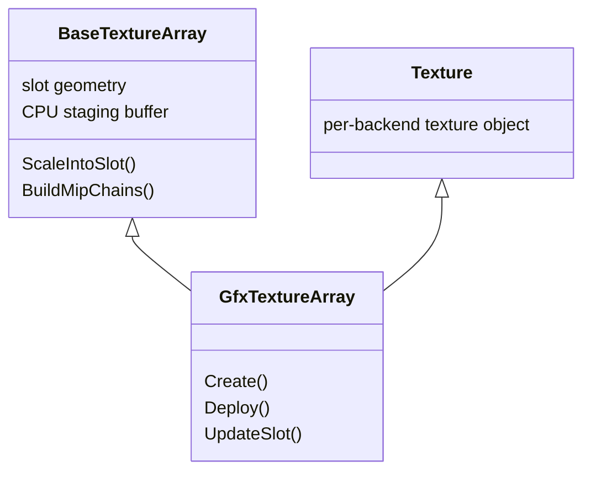
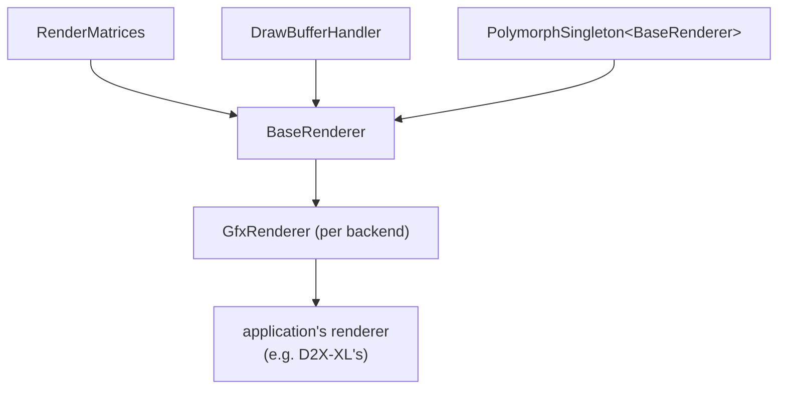

# Layering and Specialization

The library has to be three libraries at once: an OpenGL one, a Vulkan one and a DirectX 12 one, with
the same behaviour and the same call sites. It does that without an abstract interface layer, and
without a single virtual call between the application and the driver.

Three mechanisms carry the whole structure. They are orthogonal and used for different reasons.

## 1. One name, three files - the build picks

The load-bearing decision. A class that has to exist in every backend exists *once per backend*, in a
file of the same name, under that backend's `include/` and `src/`:

```
opengl/include/texture.h      class Texture   (GL texture name, glTexImage2D)
vulkan/include/texture.h      class Texture   (VkImage + VkImageView, staging buffer)
directx/include/texture.h     class Texture   (ID3D12Resource + SRV descriptor)
```

Shared code writes `#include "texture.h"` and `Texture`, and the include path decides which one it
gets. Everything that is rendered - a mesh, a font, the skybox - is compiled against one backend's
types directly.

The classes that work this way are the ones that touch the driver:

| Name | Role |
| --- | --- |
| `GfxRenderer` | the concrete renderer, derived from the shared `BaseRenderer` |
| `GfxStates` | render state (see [02](02-api-abstraction.md)) |
| `Shader`, `ComputeShader` | program objects and their parameters |
| `Texture`, `GfxTextureArray`, `Cubemap`, `TextureBuffer`, `LinearTexture` | texture shapes |
| `RenderTarget`, `ReadTarget` | offscreen targets |
| `GfxDataBuffer`, `GfxDataLayout`, `SSBO` | GPU buffers and vertex layout |
| `MeshHandler` | mesh instantiation |
| `CommandList` | recorded GPU work (Vulkan and DX only) |
| `AccelerationStructure` | ray tracing (Vulkan only in substance) |

### Why not an interface with virtual methods

An interface would mean a vtable dispatch on every texture bind, buffer update and state change, a
second object per resource, and a lowest common denominator API frozen at the moment the interface
was written. None of it buys anything, because **no binary ever contains two backends**. The choice
is made when the library is built, so a runtime dispatch would decide something that is already
decided.

What this costs: the three files drift unless they are kept aligned deliberately. There is no
compiler check that `Texture` in the Vulkan build has the same interface as in the OpenGL build - the
only check is that the shared code compiles against all three. In practice that catches signature
drift quickly, because everything above the backend is shared.

What it buys, besides the call cost: each backend can be written idiomatically. The Vulkan `Texture`
carries an image layout and a staging buffer, the DX one a descriptor index, the GL one nothing but a
name. Nothing has to be modelled twice or emulated.

## 2. Base class in `include/`, specialization in the backend

Where a class has substantial work that contains no API at all, that work is lifted into a base class
in the shared `include/`, and each backend derives from it and adds only the API part.



`BaseTextureArray` holds the slot geometry, one flat CPU buffer in exactly the layout every backend's
3D upload call wants, the bilinear scaler that fits an undersized image into a slot, and the mip chain
builder. `GfxTextureArray` adds the upload - and nothing else. Three backends therefore share one
implementation of the only part that is real work.

The shared halves currently in `include/`:

| Base class | Specialization adds |
| --- | --- |
| `BaseRenderer` | `GfxRenderer`: device init, command lists, present, back buffer read |
| `BaseShaderHandler` | the per-backend `ShaderHandler` plus the shader source tables |
| `BaseTextureArray` | the upload of the staged slots |
| `BaseQuadMesh` | the backend's `Mesh` for the unit quad |
| `BaseNoiseTexture` | the upload of generated noise volumes |
| `BaseReadTarget` | the backend's readback path |
| `BaseDisplayHandler` | window, swap chain, present |

Note what these base classes are *not*: they are not polymorphic interfaces. `BaseTextureArray` has a
non-virtual destructor on purpose - nothing holds one through a base pointer. The inheritance is code
sharing, not dispatch. `BaseRenderer` is the exception, and for a reason given below.

## 3. The renderer is meant to be derived from - twice

`BaseRenderer` is the one place where virtual dispatch is deliberate, because there are two
independent layers of specialization stacked on it:



- **`GfxRenderer`** specializes it per API. It overrides `InitGraphics`, `StartOperation` /
  `FinishOperation`, `DrawScreen`, `ReadBuffer`, the pipeline cache hooks and the resource cleanup
  hooks. `#define baseRenderer GfxRenderer::Instance()` is how everything reaches it.
- **The application** specializes it again, for what a viewport, a scene buffer or a camera means in
  that game. `SetViewport`, `SetSceneBuffer`, `ActivateCamera`, `UsePostEffectShader` are virtual for
  that reason: D2X-XL's renderer, for instance, adds the scissoring that the viewport transformation
  cannot do.

`PolymorphSingleton` is what makes the second layer work: the instance pointer is typed on
`BaseRenderer`, the derived constructor assigns it, and each level's `Instance()` narrows it with a
`dynamic_cast`. So the library's own code reaches the renderer through `BaseRenderer`, while the
application reaches its own through the same singleton.

`BaseRenderer` also *inherits* two of its responsibilities rather than owning them as members:
`RenderMatrices` (the matrix stacks and the projector) and `DrawBufferHandler` (the render target
stack). Both are shared, API-free, and every call site wants them on the renderer -
`baseRenderer.PushMatrix()`, `baseRenderer.ResetDrawBuffers()`.

## Access through singleton macros

The library's services are singletons, reached through a lower-case macro that reads like a global
object:

```
baseRenderer  gfxStates  baseShaderHandler  textureHandler  meshHandler
baseDisplayHandler  sdlHandler  commandListHandler  gfxResourceHandler
cbvAllocator  descriptorHeaps  descriptorPoolHandler  samplerCache
pipelineCache  psoHandler  vkContext  skybox  textRenderer  lightningLook
```

Several of those exist only in some backends - `descriptorHeaps` and `psoHandler` are DirectX,
`descriptorPoolHandler`, `pipelineCache` and `vkContext` are Vulkan, `commandListHandler`,
`cbvAllocator`, `samplerCache` and `gfxResourceHandler` exist in both but not in OpenGL. Shared code
does not name them; they appear only inside the backend that has them, or behind a `BaseRenderer`
virtual (`FlushResources`, `Cleanup`, `LoadPipelineCache`) that is a no-op in OpenGL.

`gfxStates` and `baseRenderer` are the two the application sees constantly.

## Where the boundary actually runs

A useful way to read the layout: shared code may name anything in `include/`, plus the *names* listed
in section 1. It may not name a driver type - no `GLuint`, no `VkImage`, no `ID3D12Resource`. Where a
shared class needs to store a handle, it stores `GfxTypes::Handle`; where it needs a format, it stores
`GfxPixelFormat`. Both are described in [02-api-abstraction.md](02-api-abstraction.md).

The one systematic exception is HLSL: the shader sources are written once in HLSL and translated for
the other two backends. That is [08-shaders.md](08-shaders.md).

## Divergences

- **`gfxtypes.h` and `gfxdrivertypes.h` are near-duplicates.** Both define `namespace GfxTypes` with
  the same aliases; `gfxdrivertypes.h` lacks `Bitfield` (in the Vulkan and DirectX copies) and the
  `UavTexture` / `StructuredBuffer` tag structs. Only `opengl/include/gfxstates.h` includes
  `gfxdrivertypes.h`; nothing else in the library does. The Vulkan and DirectX copies of it are
  therefore unused.
- **Copied header comments.** `vulkan/include/gfxtypes.h` carries the DirectX file's comment text
  ("DirectX 12-specific type aliases", "directx/include/ takes precedence"). Same for
  `vulkan/include/gfxrenderer.h`'s reference to `SetupOpenGL`, and for the "DX12 BaseRenderer" heading
  on the shared `base_renderer.h`. The code is correct; the comments name the wrong backend.
- **Include order does not actually give the backend precedence**, although several comments say it
  does: the project files list `..\..\include` (shared) *before* `..\include` (backend). It works
  because no file name exists in both directories - there is no `gfxtypes.h`, `texture.h` or
  `shader.h` in the shared `include/`. The mechanism is "the file exists in exactly one place", not
  "the backend wins".
- **`src/gfxapitype.inl` is dead.** It assigns `BaseRenderer::gfxApiType` from the `DIRECTX` /
  `VULKAN` preprocessor symbols - the mechanism that preceded today's assignment in each
  `GfxRenderer` constructor. Its only `#include` is at the end of `opengl/src/ogl_base_renderer.cpp`,
  and that file is not in the OpenGL project; all three project files list the `.inl` as a
  non-compiled item.
- **`opengl/src/ogl_base_renderer.cpp`, `opengl/include/ogl_base_renderer.h` and
  `opengl/src/ogl_shadowmap.cpp` are not built** - no project file compiles them and no header
  includes them. The OpenGL build takes `BaseRenderer` from the shared `src/base_renderer.cpp`, as
  the other two backends do.
- **`directx_tmp_placeholder/`** is an empty directory carrying only a same-named empty child.
