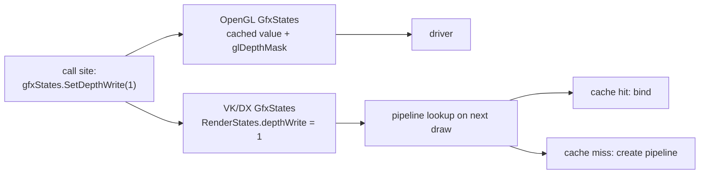

# The API-Neutral Vocabulary: Types, Formats, States, Modes

Everything above the backend is written in one vocabulary. This document describes that vocabulary -
what it names, what it deliberately does not name, and what each backend does with it.

The vocabulary lives in three shared headers plus one class that exists per backend:

| Where | What |
| --- | --- |
| `include/rendertypes.h` | topology, component types, pixel formats, wrap modes, texture types, and the `GfxOperations` state enums |
| `include/texturesampling.h` | `TextureSampling` - a complete sampler description |
| `include/shaderdatalayout.h` | the vertex attribute slots a shader expects |
| `<backend>/include/gfxtypes.h` | `GfxTypes::Int/Uint/Float/Enum/Handle/Bitfield` - the scalar types |
| `<backend>/include/gfxstates.h` | `GfxStates` - the live render state |

## Scalar types: `GfxTypes`

The smallest layer. Shared code that has to hold a driver-sized integer, a resource handle or a
bitfield uses `GfxTypes::Int`, `GfxTypes::Uint`, `GfxTypes::Float`, `GfxTypes::Enum`,
`GfxTypes::Handle`, `GfxTypes::Bitfield`.

In OpenGL these alias `GLint`, `GLuint`, `GLfloat`, `GLenum`, `GLbitfield` - the authoritative types
of the driver's own calls. In Vulkan and DirectX they alias fixed-width C++ types, because neither
API imposes its own scalar spelling on a caller; there `Handle` is a descriptor index rather than an
object name.

That last difference matters more than it looks: in OpenGL a handle *is* the GPU object, in DX and VK
it is an index into a descriptor heap / pool that refers to one. Shared code never dereferences a
handle, so it does not have to know - but a backend's implementation of the same class is shaped
differently because of it (see [07-textures-and-samplers.md](07-textures-and-samplers.md)).

`GfxTypes` also carries two empty tag structs, `UavTexture` and `StructuredBuffer`, used as overload
tags where a call has to say which kind of resource view it wants.

## Enumerations: `rendertypes.h`

The neutral names for everything a call site has to say about geometry, pixels and state.

**Geometry and data**: `MeshTopology` (Quads, Triangles, Lines, Points), `ComponentType` (Float,
UInt32, UInt16), `GfxBufferTarget` (Vertex, Index).

**Textures**: `TextureType` (Texture2D, Texture3D, CubeMap, Texture2DArray), `GfxWrapMode` (Repeat,
ClampToEdge, ClampToBorder).

**Pixel formats**: `GfxPixelFormat` names the formats the library actually uses, in Vulkan's channel
notation (`RGBA32_SFloat` = four float32 channels) so that the name is unambiguous no matter which
backend reads it. It covers the plain uncompressed formats, the HDR ones (`RGBA16_SFloat`,
`RG11B10_SFloat`), the integer ones, the sRGB twins, and the block-compressed BC1/BC4/BC5/BC7 pair
set.

Around the enum sit `constexpr` helpers that let shared code do format arithmetic without touching a
native format descriptor: `GfxPixelStride` (bytes per pixel), `GfxIsBlockCompressed`, `GfxBlockBytes`
(bytes per 4x4 block), `GfxIsIntegerFormat`, and the sRGB/linear pair `GfxSRGBFormat` /
`GfxLinearFormat` with the selector `GfxEncodedFormat`. Each backend maps the enum to its native
format in its own `gfxpixelformat_gl.h` / `_vk.h` / `_dx.h`.

The sRGB pairing is an architectural point rather than a convenience: whether a sampler decodes a
texture to linear is a property of the *format*, not of the sampler or the shader, in all three APIs.
Keeping the two spellings of the same blocks side by side lets an upload decide encoding at the last
moment without a second code path.

**Render state**: namespace `GfxOperations` holds `CompareFunc`, `BlendFactor`, `BlendOp`, `CullFace`,
`Winding`, `FillMode`, `StencilOp`, `BufferFlag`, and one level above them, `BlendMode`.

### `BlendMode`: naming the combination, not the parts

`BlendMode` (Replace, Alpha, Additive, Multiply, AlphaControlled) is the most deliberate piece of the
vocabulary. A draw says what it should *look* like; `GfxOperations::BlendFactors` turns that into the
factor pair, in one shared `constexpr` function.

Two reasons, both architectural:

- A backend that cannot set blending per draw - Vulkan and DX12 bake it into the pipeline - keys its
  pipeline on **one** value instead of two, and the set of keys is the set of named modes rather than
  the cross product of all factors.
- `BaseRenderer::SetBlendMode` sets *all three* pieces of state that belong together: the enable, the
  factor pair and the equation. The equation in particular used to leak: a step that switched to
  `Max` (lightning, glow) left it behind for whatever ran next.

The list is intentionally not a complete enumeration of possible factor pairs. A new combination is
added to the enum, not assembled at a call site.

## The render state: `GfxStates`

`GfxStates` is the one piece of the vocabulary that is *not* shared - it exists once per backend,
reached as `gfxStates`. Its interface is the same everywhere; what happens behind it is the single
biggest difference between OpenGL and the other two.

### The contract

**`SetX()` returns the PREVIOUS state. `GetX()` asks without changing anything.**

This is a rule the whole library depends on, because it is how a pass saves and restores state around
itself. Internally every setter doubles as its own query through an "unknown" sentinel: `-1` for the
integer toggles, `GL_NONE` for the enum states, which is what `GetX()` passes.

The rule is worth stating because it was once broken: OpenGL's setters returned their *argument*
while DX and VK returned the previous value, which made the same line of shared code mean two
different things per backend and silently turned every save/restore around an OpenGL draw into a
no-op.

A second, complementary rule: a stage sets what it needs rather than restoring what it found.
`GfxStates::ClearDepthBuffer` enables depth writes (a GL clear is masked by the write mask) and
deliberately leaves them enabled afterwards.

### OpenGL: a cache in front of an immediate-mode API

Every state in the OpenGL `GfxStates` is a cached value in front of a `gl*` call, and the call is only
made when the value actually changes. Two templates do it:

- `SetState<stateID>` for the `glEnable`/`glDisable` toggles, with the current value in a function
  local `static`;
- `FuncState` for everything with parameters, keyed by an id into a per-type registry, in a single
  and a tuple-valued variant.

`ENFORCE_STATE` (compile-time, currently `false`) turns the filtering off so that every call reaches
the driver - a diagnostic for state cache mismatches.

The GL version also owns what only GL has: extension and feature level queries (`HasExtension`,
`FeatureLevel`), and the TMU binding table (`TextureSlotInfo`) that tracks which texture is bound to
which unit, so a rebind of an already-bound texture costs nothing.

### Vulkan and DirectX: a struct that becomes a pipeline key

There is no immediate state to set. `GfxStates` writes into a `RenderStates` struct - `ActiveState()`
returns `baseRenderer.RenderStates()`, i.e. the renderer owns the live state block - and that struct
*is* the pipeline lookup key.

`RenderStates` (in `<backend>/include/renderstates.h`) is packed, memcmp-comparable and holds
everything a pipeline is built from: rasterizer (cull mode, winding, fill mode, depth clip, depth
bias), depth/stencil (test, write, compare, the full front and back stencil op sets, ref, read mask,
write mask), blending for up to 8 color targets plus the independent-blend flag, color masks,
topology, and the scissor enable.

The DirectX version carries four extra fields: `colorFormat`, `depthFormat`, `mrtFormats[]` and
`colorTargetCount`. A D3D12 PSO must name the exact RTV/DSV formats it will be used with, so the
formats of the currently bound render target are part of the key. Vulkan does not need them there,
because its pipelines are created against dynamic rendering formats supplied separately.

The lookup itself differs:

- **DirectX**: `PSO::GetPSO(shader)` looks up `{Shader*, RenderStates}` in an AVL tree, creating the
  `ID3D12PipelineState` on a miss. It additionally supports an `ID3D12PipelineLibrary` on disk plus a
  record of `{shader name, states}` pairs, so a later run can pre-create the pipelines it needed last
  time instead of building them during play.
- **Vulkan**: `PipelineCache` fills the equivalent role, with `VkPipelineCache` as the on-disk part.
  It also puts some of the state into Vulkan's *dynamic* state
  (`RenderStates::SetDynamicStates(VkCommandBuffer)`), which removes it from the key entirely.

This is the deep asymmetry the abstraction hides: in OpenGL a state change is a driver call that may
or may not be filtered out; in Vulkan and DX it is a struct field that may or may not cause a
pipeline to be built. Setting a state is cheap everywhere. Setting an *unusual combination* of states
is cheap in OpenGL and expensive on first use in VK/DX.

### GL compatibility constants in the VK and DX headers

Both non-GL `gfxstates.h` define `GLenum` and a set of `GL_*` constants with their OpenGL numeric
values. This is a migration aid: it lets call sites that were written against the GL spelling compile
unchanged, with the value translated when the pipeline is created. New code uses the `GfxOperations`
spelling; the GL-flavoured overloads exist alongside it (`DepthFunc(GLenum)` next to
`DepthFunc(CompareFunc)`) and OpenGL additionally offers `GetDepthFuncGL()`-style queries for an
application that speaks GL anyway.

## Sampler description: `TextureSampling`

A packed struct carried by every `Texture`: min/mag filter, mip mode, the three wrap modes, compare
function, anisotropy, LOD bias and range, border color. It is comparable by `memcmp` so it can be a
map key.

Each backend translates it on first bind and caches the result, so textures that want the same
sampling share one backend sampler object (`samplerCache` in DX and VK). The three filter fields are
kept separate although D3D12 packs them into a single `D3D12_FILTER` value, so that the translation
is a pure mapping in both directions.

OpenGL is the outlier: it has no sampler objects in this library at all. Filtering and wrapping are
state of the texture object itself, set with `glTexParameteri` when the texture is bound. The
consequence is described in [07-textures-and-samplers.md](07-textures-and-samplers.md); it is the
clearest case in the library of an abstraction that is uniform at the call site and genuinely not
uniform underneath.

## What the vocabulary deliberately does not name

- **Resource lifetime and residency.** There is no neutral "GPU memory" concept. OpenGL has none to
  model, and VK/DX solve it with quite different machinery ([04](04-command-lists.md)).
- **Synchronization.** No neutral barrier, fence or semaphore type. Vulkan tracks image layouts
  (`image_layout_tracker.h`), DX12 tracks resource states, OpenGL tracks nothing. The barrier is
  placed by the backend that needs it, at the point where it knows what is about to happen.
- **Descriptors.** Heaps, pools and sets are backend-internal. A shared caller names a texture and a
  slot index; what that becomes is the backend's business.

The line is consistent: the vocabulary covers what a *renderer* decides, not what a *driver* requires.

## Divergences

- `GfxStates::HasExtension` is a real query in OpenGL and returns `false` unconditionally in Vulkan.
  Call sites gated on an extension therefore take the "not available" path in the VK build.
- `FeatureLevel` means three different things: GLSL version times 100 in OpenGL, the encoded Vulkan
  API version in VK, a D3D feature level in DX. The values are only comparable against that backend's
  own `MinFeatureLevel` / `SSBOFeatureLevel` constants, never against each other.
- Several `GfxStates` entry points exist only to keep the interfaces identical and do nothing in some
  backends: `SetPolygonOffsetFill`, `SetDither`, `SetMultiSample`, `SetLineSmooth` are real toggles in
  OpenGL and stubs in VK/DX (the polygon offset is always live there, being rasterizer state);
  `SetIndependentBlend` is the reverse - a real flag in VK/DX, a no-op in OpenGL, which has per-draw-
  buffer blending natively.
- The per-draw-buffer OpenGL blend calls (`glBlendFuncSeparatei`, `glEnablei`, `glColorMaski`) bypass
  the state cache and invalidate the cached entry. After an MRT pass that used them, the global blend
  state has to be re-issued explicitly or a later pass inherits a desynchronized RT1.
- `GfxOperations::CullFace::None` maps to `GL_FRONT_AND_BACK` in OpenGL. The round trip through
  `GLToGfx` is stable, but the neutral name and the GL meaning are not the same thing - "cull nothing"
  vs. "cull both".
