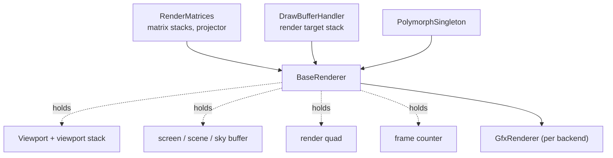
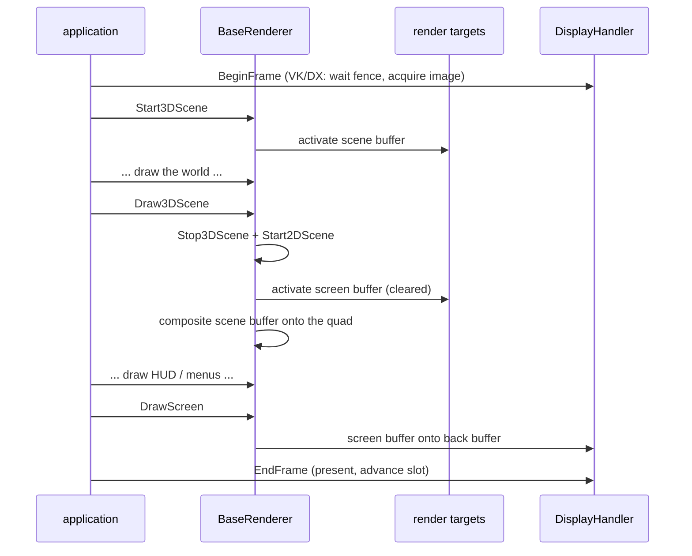

# The Renderer and the Frame

`BaseRenderer` is the library's centre. Everything an application draws goes through it, and almost
everything the library offers is reachable from it. This document describes what it holds, how a
frame is structured, and how coordinates get from a model to a pixel.

## What the renderer is composed of

The two base classes are inherited rather than held, so that a call site reads
`baseRenderer.PushMatrix()` and `baseRenderer.ResetDrawBuffers()`. Both are API-free and shared by all
three backends. `DrawBufferHandler` is the subject of
[05-render-targets-and-draw-buffers.md](05-render-targets-and-draw-buffers.md).

The three render targets it owns are the fixed points of the frame:

- **scene buffer** - where the 3D world is rendered. It is a stack, not a single value:
  `SetSceneBuffer(rt)` pushes, `SetSceneBuffer(nullptr)` pops. A pass that renders the world
  somewhere else (a camera monitor, a reflection) pushes its own and pops it again.
- **sky buffer** - the background layer.
- **screen buffer** - the 2D composition target, created by `CreateScreenBuffer` at window size with
  one color buffer. Its content is what `DrawScreen` puts on the back buffer.

## Coordinates: matrix stacks and the projector

`RenderMatrices` holds not one matrix stack but an array of `MatrixStack`, selectable by index
(`SelectMatrixStack`, `AddMatrices`). A stack carries the model-view and four projections - the
current one, a 2D one, a 3D one and one for effects - plus a `Projector` that owns the frustum
parameters (`FoV`, `AspectRatio`, `ZNear`, `ZFar`).

Several stacks exist so that a renderer that draws from more than one point of view - a mirror, a
camera monitor, a shadow pass - can switch a whole coordinate system with one index instead of
rebuilding matrices.

Matrices are row-major. `PushMatrix` / `PopMatrix` and `Translate` / `Rotate` / `Scale` are the
familiar fixed-function verbs, preserved deliberately: the application layer was written against them
and they are a compact way to express nested transforms. `SetupTransformation` and
`ResetTransformation` switch between the 3D and 2D setups.

Shaders receive the matrices through `Shader::SetMatrix4f(eBaseMatrices, ...)`, where `eBaseMatrices`
is `bmModelView`, `bmProjection`, `bmViewport`, `bmLightTransform`. These four are addressed by enum
rather than by name because they are the base inventory every shader has; everything else a shader
needs is set by name. See [08-shaders.md](08-shaders.md).

## Viewports: a transformation, not a scissor

This is the least obvious decision in the renderer and it shows up everywhere.

`BaseRenderer::SetViewport(viewport, ...)` does **not** set the graphics viewport to the given
rectangle. It sets the graphics viewport to the *whole* active render target -
`gfxStates.SetViewport(0, 0, windowWidth, windowHeight)`, where width and height come from the active
draw buffer if there is one and from the window otherwise - and then builds a transformation matrix
that maps normalized coordinates into the requested rectangle
(`Viewport::BuildTransformation`).

Consequences, all of them architectural:

- **The graphics viewport always covers the entire bound target.** That is an invariant every render
  target activation can rely on, and it is why a render target switch does not have to restore a
  viewport rectangle.
- **A viewport scales, it does not clip.** Geometry outside the rectangle is squeezed into it rather
  than cut off. An application that needs real clipping has to add a scissor; D2X-XL's renderer
  overrides `SetViewport` to do exactly that, which is why the method is virtual.
- **Vertical flip lives here.** `flipVertically` both mirrors the rectangle's top coordinate and is
  passed into the transformation - but only combined with `UsesOpenGL()`, because the flip exists to
  reconcile GL's bottom-left framebuffer origin with the top-left origin of the other two.

`PushViewport` / `PopViewport` keep a static stack. `PushViewport` also snapshots the *native*
viewport (`Viewport::GetGfxViewport`), so the restore is exact. In debug builds the pushing function's
name is recorded in the entry, which is the fastest way to find an unbalanced push.

## The frame

**`Start3DScene`** resets the draw buffer stack, activates the scene buffer, sets up the 3D
transformation, applies the scene viewport and activates the camera. **`Stop3DScene`** deactivates
them again.

**`Start2DScene`** resets the draw buffer stack, sets the clear color to the background color,
resets the transformation to 2D, sets the viewport to the whole window, applies the 2D render states
and activates the screen buffer with a clear. If the screen buffer is not available it falls back to
the back buffer directly. `m_screenIsAvailable` records which of the two happened, and every later
step reads it.

**`Draw3DScene`** is the bridge: it stops the 3D scene, starts the 2D scene, and draws the scene
buffer as a texture on the render quad. If the application supplies a post effect shader
(`UsePostEffectShader` / `LoadPostEffectShader` - tone mapping an HDR target, for example) the quad is
drawn with that shader, under a matrix that is flipped for OpenGL only.

**`DrawScreen`** (per backend) puts the screen buffer on the back buffer and then calls
`UpdateFrameMetrics`, which clears `m_screenIsAvailable` and bumps the frame index.

### Render passes

`RenderPassType` is `rpShadows`, `rpColor` or `rpFull`, and `StartShadowPass` / `StartColorPass` /
`StartFullPass` each set a complete, named block of state rather than a single flag:

- **shadow**: depth test and write on, `Less`, color mask off, blending off. The commented-out
  `SetPolygonOffset` is the caster-side slope-scaled depth bias, kept in place with its reasoning.
- **color**: depth test on, depth write *off*, `LessEqual`, color mask on. Depth comes from a prior
  pass.
- **full**: as color, but with depth write on.

Both non-shadow passes explicitly clear the polygon offset, so a shadow pass cannot leak its bias into
what follows. `Set3DRenderStates` and `Set2DRenderStates` are the two ground states; `Set3DRenderStates`
derives its depth write default from the current pass.

### Frame-level work outside the renderer

`BaseDisplayHandler` owns the window, the display modes and the swap chain, and it is where a frame
actually begins and ends. It is a `PolymorphSingleton` too, so an application can derive from it -
`RequestDisplayChange` exists for exactly that, because a resolution change has to happen *between*
frames, never inside one.

The startup order differs per backend and is not hidden, because it cannot be: in Vulkan the device
needs the surface, which needs the window, and the swap chain needs the device, so window creation,
`InitGraphics` and `SetupSwapchain` are three separate steps in that order. DirectX creates its swap
chain inside display setup.

## Drawing without geometry

Three conveniences on the renderer cover the cases where there is nothing to draw but a rectangle:

- `Render(shader, textures, color)` draws the render quad with the given shader and textures. The
  texture parameter is a `std::span<Texture* const>`, with overloads for a single texture and for a
  braced list - see [06-buffers-and-meshes.md](06-buffers-and-meshes.md) for why.
- `RenderToViewport(texture, color, rotate, flip, shader)` draws a texture into the current viewport,
  optionally rotated by 90 degrees and/or flipped.
- `Fill(color, scale)` fills the current viewport, and `Viewport::Fill` does the same for a viewport
  that is not the current one.

`m_renderQuad` is a `BaseQuadMesh` created once in `Create`. Practically every post-processing step
in either application ends up going through it.

## Backend operations without a pass: `StartOperation` / `FinishOperation`

Work that has to reach the GPU but does not belong to a render pass - an upload, a buffer copy, a mip
build during loading - needs a command list in Vulkan and DirectX and needs nothing at all in OpenGL.
`BaseRenderer::StartOperation` / `FinishOperation` is that difference, reduced to a pair of calls that
are valid in all three:

- **OpenGL**: `StartOperation` returns `nullptr`, `FinishOperation` returns `true`. There is nothing
  to open.
- **Vulkan / DirectX**: if a command list is already current, it is used (with a reference count if it
  is a temporary one). Otherwise, with `piggyback` set, the renderer's spare temporary list is joined
  if one is open, and only failing that is a new temporary list created and opened. `FinishOperation`
  decrements the count and closes - or flushes, if the caller needs the work to have finished - when
  it reaches zero.

The piggyback rule is what keeps a loading phase from producing one command list per texture: a
sequence of uploads shares one list until somebody asks for a flush.

## Instrumentation

`MovingFrameCounter` (`framecounter.h`) measures a moving-average frame rate and can draw itself as an
overlay in a corner viewport, set up in `BaseRenderer::Init`. `GfxStates::CountDraw` / `DrawCount` /
`ResetDrawCount` count every draw the library issues, so an application can read the cost of a pass in
draws - that counter is what batching work is measured against.

Tracy zones are compiled in via `USE_TRACY`; `gpuzone.h` and `gputimer.h` add GPU-side timing, with a
zone per command list in Vulkan and DirectX.

## Divergences

- Several `GfxRenderer` responsibilities are no-ops in OpenGL by design, through `BaseRenderer`
  defaults: `FlushResources`, `Cleanup`, `LoadPipelineCache`, `SavePipelineCache`,
  `PrecreatePipelines`.
- `Draw3DScene` passes `flipVertically = true` in OpenGL and `false` in the other two; the same holds
  for the post effect path, which scales by -1 in Y for OpenGL only.
- `SetGeometryFrontFace` / `SetShadowFrontFace` are inverted between OpenGL (`Reverse` for geometry)
  and Vulkan/DirectX (`Regular` for geometry), and the VK/DX renderers additionally initialize
  `m_frontFace` / `m_backFace` in their constructors where the OpenGL one leaves them at `None`.
- The header comments on `base_renderer.h` and both non-GL `gfxrenderer.h` still describe a DX12 port
  in progress ("SetupOpenGL -> SetupDX12 internally"). `SetupGraphics` is the current name in all
  three.
- `BaseRenderer::Draw3DScene` guards its quad draw with a function-local `static bool renderScene =
  true` - a debug switch that is never written.
