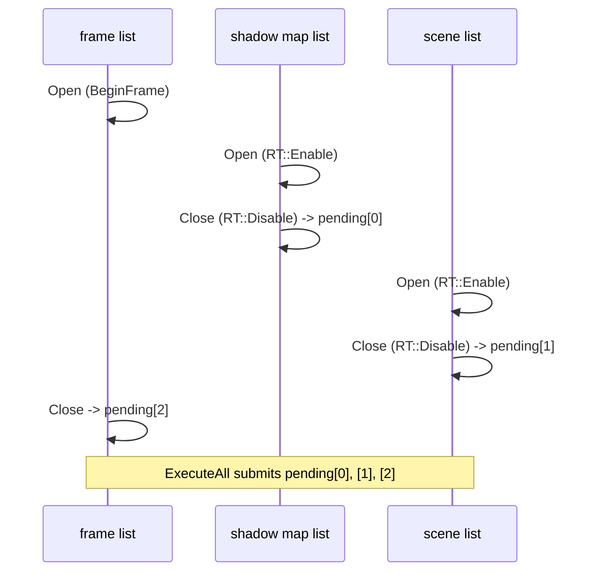
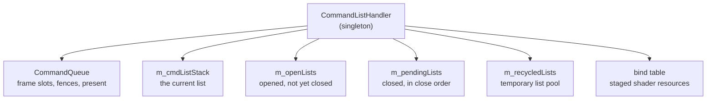

# Command Lists and Render Tasks

OpenGL has no command lists: a call reaches the driver when it is made. Vulkan and DirectX 12 record
work into a buffer that is submitted later, and everything about ordering, lifetime and
synchronization follows from that. This document describes the model the library imposes on both, so
that the layer above does not have to know which of the two it is talking to.

The model is DX12-shaped and Vulkan follows it idiomatically, because DX12's command list is the more
constrained of the two and anything that satisfies it also satisfies Vulkan.

## One render task, one command list

The central rule:

> **A render task lives strictly between `Open()` and `Close()`. Tasks are not nested. The execution
> order is the CLOSE order - whichever list is closed first is submitted first.**

A render task is one `RenderTarget::Enable` -> draws -> `RenderTarget::Disable` scope. It maps 1:1
onto a Vulkan render pass (a `vkCmdBeginRendering` scope) and onto a DX12 command list with one set of
render targets bound.

Close order rather than open order is what makes the rule work with nesting *in the source*: an inner
scope opens later and closes earlier, so it is submitted first - which is exactly what an inner scope
means (render the shadow map, then use it). The lists themselves are never nested; only the source
code that creates them is.

## The pieces

**`CommandList`** owns one command allocator (DX) or command pool (VK) *per frame slot*, plus one
command list / command buffer allocated from each. `Open()` switches to the active frame slot's pool,
resets it and begins recording; `Close()` ends recording and registers the list for submission;
`Flush()` submits it immediately and waits.

It also carries what has to be remembered across a list's lifetime: its id and name, an execution
counter, a reference count (for the piggybacking described in
[03-renderer-and-frame.md](03-renderer-and-frame.md)), the currently bound pipeline and topology, a
list of disposable resources, and its GPU profiling zone.

**`CommandListHandler`** is the singleton that routes everything. It owns the `CommandQueue`, the
stack of currently active lists, the open and pending lists, the pool of recycled temporary lists,
and the per-draw bind table. It is also the single owner of the frame index and frame count -
`BeginFrame`, `EndFrame`, `ExecuteAll` and `Flush` are its.

**`CommandQueue`** owns the actual queue, the per-frame-slot synchronization and the present. With
`FRAME_COUNT = 2` it double-buffers: `BeginFrame` waits on the current slot's fence and acquires the
next swap chain image, `EndFrame` presents and advances.

The Vulkan semaphore indexing is worth noting as an example of what the abstraction cannot hide:
`imageAvailable` and the in-flight fence are indexed by *frame slot*, but `renderFinished` is indexed
by *swap chain image*, because the driver may return acquired image indices in any order and a
slot-indexed signal semaphore could be re-signalled while its previous image is still pending
presentation.

## The list stack and "the current list"

`PushCmdList` / `PopCmdList` maintain a stack; `CurrentCmdList()` is its top. Everything that records
work - a draw, a barrier, a copy - asks the handler for the current list rather than being handed one.

Two consequences:

- **`BaseRenderer` holds a frame list**, open from `BeginFrame` to `EndFrame`. The outer game loop
  records into it. If it is closed or dead when something tries to draw, the result is a crash inside
  the API's validation layer - and that crash is usually a *symptom* of an earlier invalid call or a
  device removal, not its cause.
- **Every render target opens its own list** in `Enable` and closes it in `Disable`. So a draw inside
  an `Enable`/`Disable` scope lands in that target's list, and a draw outside any scope lands in the
  frame list. Nobody passes a list around.

A *detached* list is the exception: it registers itself for submission at `Open` and does not join the
stack, so it records work that belongs to the frame but not to the current scope.

## Temporary lists and their pool

Work outside a render pass - uploads, copies, mip generation - uses a temporary list, obtained through
`CommandListHandler::CreateCmdList` or, at the renderer level, `StartOperation`.

Temporary lists are pooled in `m_recycledLists`. The pool's invariant: **a list in the pool has been
executed and is closed** - a defined end state, so a list taken from it can be opened without
checking what happened to it before. They are recycled after `ExecuteAll`.

## Submission

`ExecuteAll` is called once per frame, before `EndFrame`:

1. anything still recording is forced closed (which registers it);
2. the pending lists are submitted **in close order** - one `vkQueueSubmit2` over all command buffers
   in Vulkan, one `ExecuteCommandLists` in DirectX;
3. the pending list is cleared and the temporaries are recycled.

`ExecutePending` (Vulkan) is a partial variant: it submits what has been closed so far and waits for
it, leaving lists that are still recording alone. It exists for a mid-frame CPU readback, where the
draws to be read sit in closed but unsubmitted lists.

`Flush` at handler level is `ExecuteAll` plus a wait and a cleanup drain. It is the init-time path,
used where there is no frame fence yet. `BaseRenderer::FlushResources` exposes it, and
`BaseRenderer::Cleanup` is its shutdown counterpart: wait idle, drain the deferred cleanup queues,
destroy the command list infrastructure - before the general resource handlers are torn down. Both
are no-ops in OpenGL.

## Resource lifetime: deferred destruction

A resource dropped in mid-frame may still be referenced by command buffers the GPU has not finished
with. Destroying it immediately is a use-after-free on the GPU side.

`GfxResourceHandler` solves this with one mechanism, `TrackCleanup(lambda)`: the lambda is registered
against the *currently active frame slot* and executed the next time that slot becomes active - i.e.
after that frame's fence has signalled, at which point the GPU is provably done. With two frame slots
that is a deferral of one full frame.

It is used for every resource that can outlive its owner by a frame: texture destruction and the
upload path's image replacement, render target buffer release, linear texture updates, buffer
destruction.

Two details that the class comments make explicit and that matter for anyone adding a resource type:

- **Deferral applies to every texture, not only to short-lived ones.** A caller may drop a long-lived
  texture in mid-frame just as well.
- **The handler can die before its clients.** Objects with static storage duration are destroyed in an
  order nobody controls, and some of them own GPU resources. `s_isAlive` makes `TrackCleanup` fall
  back to running the lambda inline once the handler is gone - by then the GPU is idle anyway.
  `GfxStates` carries the same guard (`IsDestroyed`) for the same reason: its binding lists are gone
  while textures are still dropping their bindings.

A command list has its own, narrower version: `AddResource` attaches a disposal lambda to the list
itself, fired by `DisposeResources` when the list's work has been executed.

## The bind table

Neither Vulkan nor DirectX binds a texture the way OpenGL does. The library gives both the OpenGL
shape at the call site - `Texture::Bind(slot)` - and stages the result:

`Texture::Bind`, `RenderTarget::BindBuffer` and `GfxArray::Bind` write into a CPU-side table on the
handler, at the logical `t`/`s`/`u` slot. Right before each draw, `Shader::UpdateVariables`
materializes that table: in Vulkan into a `VkDescriptorSet` (allocated from `descriptorPoolHandler`,
written with `vkUpdateDescriptorSets`, bound with the b0/b1 dynamic offsets), in DirectX into
descriptor heap entries.

The slot counts are fixed and mirrored on the shader side: 16 sampled images, 16 samplers, 4 UAVs, 20
read-only storage buffers. A slot left null at materialize time is simply not written, which
reproduces the DX12 behaviour of an unbound slot keeping whatever the previous draw left there.

`ResetBindings` invalidates everything at frame start. `UnbindBuffer` clears every slot a given buffer
occupies - without it, a buffer destroyed while still bound would leave the table pointing into
memory that is being freed, and the next draw would write that into a descriptor set.

## Suspending a rendering scope

Vulkan forbids a copy or a fill inside an open `vkCmdBeginRendering` scope, and forbids a second
scope inside one. Two mechanisms handle that:

- **`SuspendRendering` / `ResumeRendering`** close the scope on the current command buffer and reopen
  it with its contents preserved. For work that has to stay in recording order. `RenderingScope`
  remembers whether the suspended scope belonged to a render target or to the back buffer.
- **`UploadCmdBuffer`** is the alternative for work that may run ahead of the frame - a separate
  buffer that is not inside anybody's rendering scope.

The back buffer has its own version of the same problem, and `BaseDisplayHandler` carries the state
for it: `SuspendBackBuffer` closes the scope and leaves the image as a color attachment (what a render
target becoming the draw buffer needs), while `DisableBackBuffer` also transitions it to
`PRESENT_SRC`. `m_backBufferWasWritten` decides the load operation of the *next* scope on the back
buffer: the first scope in a frame discards the old content, every later one loads it - otherwise a
render target activated in between would cost everything already drawn on the screen.

`BackBufferList()` closes the circle: the back buffer is the bottom of the render target stack and
needs a command list like any other target, so it opens one of its own when no other list is current.

## OpenGL

There is no `CommandList` in the OpenGL backend, and no `CommandListHandler`, `CommandQueue`,
`GfxResourceHandler`, `cbvAllocator` or descriptor machinery. The interfaces that exist for their sake
are `BaseRenderer` virtuals that default to doing nothing, and `RenderTarget::Enable` / `Disable`
simply bind and unbind a framebuffer object.

The asymmetry is not hidden anywhere else, which is deliberate: an OpenGL build pays nothing for
machinery it does not need, and the shared layer never mentions it.

## Divergences

- **`m_pendingLists` comments disagree with the code in DirectX.** The declaration says "registered at
  `Open()`", and the `CommandListHandler` header block says "submits all registered lists in
  registration order". `CommandList::Close` is what calls `Register`, in both backends, so both
  submit in close order. Only the Vulkan comments describe this correctly.
- `ExecutePending`, `m_openLists`, detached lists and `SuspendRendering` / `ResumeRendering` exist in
  the Vulkan backend only. The DirectX backend tracks `m_recordingLists` instead of `m_openLists` and
  has no detached mode.
- The Vulkan `CommandList` keeps a static `m_renderStateStack` with `PushRenderStates` /
  `PopRenderStates` around `Open` / `Close`, so a list restores the render state its opener had. The
  DirectX list has the same `saveRenderStates` / `restoreRenderStates` parameters.
- `vulkan/include/dx12context.h`, `vulkan/include/dx12framework.h`, `vulkan/include/dx12upload.h` and
  `vulkan/src/dx12context.cpp` are DirectX files sitting in the Vulkan tree. They are not referenced
  by `vulkan/visualstudio/rendertools.vcxproj`.
