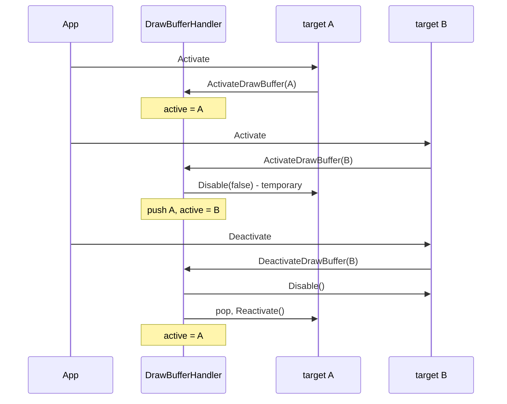

# Render Targets, Stacking, and Draw Buffer Selection

A `RenderTarget` is an offscreen surface with up to four color buffers, an optional depth/stencil
buffer, and a handful of special buffer kinds. It is also the unit of render pass scoping and, in
Vulkan and DirectX, the owner of a command list.

Three mechanisms interlock here, and they are the part of the library where an application is most
likely to get something subtly wrong:

1. **the render target stack** - which target is currently drawn into, held by `DrawBufferHandler`;
2. **draw buffer selection** - which of *that target's* buffers the fragment outputs go to;
3. **the render pass scope** - in Vulkan and DirectX, the command list and rendering scope that
   carries the draws.

## The stack: `DrawBufferHandler`

`DrawBufferHandler` is inherited by `BaseRenderer`, so its interface reads as part of the renderer. It
owns one pointer (`m_activeBuffer`) and one stack (`m_drawBufferStack`). The back buffer is the bottom
of the stack, represented by `m_activeBuffer == nullptr`.

The distinction between `Disable(false)` and `Disable()` carries the whole thing: a target that is
being *covered* by another is only temporarily disabled and will be reactivated when the cover is
removed; a target that is being *deactivated* is done.

`ResetDrawBuffers` unwinds the whole stack - `Start3DScene` and `Start2DScene` both begin with it, so
a frame's phases start from a known state regardless of what the previous one left behind.

`SuspendDrawBuffers` / `ResumeDrawBuffers` are a different operation: they push the active target away
*without* the intention of it being covered, and remember the stack depth at which the suspension
began (`m_suspendBase`). While suspended, a `DeactivateDrawBuffer` that would unwind past that base
leaves the stack alone. This is for code that has to draw on the back buffer in the middle of a scene
that is rendering into a target. The count is nested.

### What activation actually does

`RenderTarget::Activate` is the call an application makes. It is a strict sequence:

1. `Enable(params)` - bind the target, select its draw buffers, and in VK/DX open its command list and
   rendering scope;
2. `baseRenderer.ActivateDrawBuffer(this)` - push it onto the stack;
3. `PushViewport` - unless this is a reactivation, which has no `Deactivate` of its own and must not
   push;
4. `SetViewport(true)` - which, per [03](03-renderer-and-frame.md), sets the native viewport to the
   *whole* target;
5. `Clear(params)`.

`Deactivate` is the mirror: `DeactivateDrawBuffer` (which disables and pops) followed by
`PopViewport`. Activate and Deactivate are a balanced push/pop pair, and a reactivation deliberately
breaks the symmetry in exactly one place - it does not push, because the pop that follows belongs to
the original activation.

`DrawBufferHandler::SetActiveDrawBuffers` runs after a target has been pushed and before its own
`Enable`, and it is where the back buffer is told what is happening: in Vulkan and DirectX the back
buffer needs its own binding or rendering scope, and a render target's scope must not sit inside it.
So the call suspends the back buffer when a target becomes active and re-enables it when the stack
empties. Both calls are idempotent and both do nothing while no frame is being recorded, which is what
makes it safe during setup, where targets are activated long before the first frame.

In OpenGL the same method reduces to `glDrawBuffers` - an empty list *is* the default framebuffer, so
nothing else is needed.

## Buffers of a render target

`RTCreationParams` describes what a target is made of:

| Kind | Meaning |
| --- | --- |
| `btColor` | ordinary color attachments, up to `RT_MAX_COLOR_BUFFERS` (4), all in one format |
| `btDepth` | one depth attachment |
| `btStencil` | never a buffer of its own - see below |
| `btVertex` | additional MRT outputs for geometry data (world normals, world positions) |
| `btSkyMap` | compute-only storage textures, HDR format, color + sampled + storage usage |
| `btCubemap` | a cube map rendered into, one face at a time |

Two of these carry decisions worth stating:

**Stencil is a plane of the depth buffer, not a buffer.** The hardware interleaves them and a
stencil-only format is optional and rarely exposed. `stencilBufferCount > 0` therefore changes the
*depth* buffer's format (`D32_SFLOAT` becomes `D32_SFLOAT_S8_UINT`), and the stencil buffer index is
an alias of the depth buffer index.

**Array layers are a property of the target, not a buffer type.** `arrayLayerCount > 0` makes *every*
color buffer of the target a texture array of that many layers. A layer is selected with
`SelectArrayLayer` and everything else - MRT, the draw buffer groups, `GetAsTexture` - works exactly as
without it. The reason it is a flag rather than a type: such a buffer *is* a color buffer in every
respect; only its views differ.

That view distinction is the recurring theme for cube maps and arrays in Vulkan and DirectX: an
attachment addresses exactly one layer, while sampling wants a view over all of them. So a cube map
buffer carries seven views (six to render into, one cube view to sample) and an array buffer carries
one view per layer plus the array view. `AttachmentView(bufferIndex)` is what resolves it.

## Draw buffer selection

Which of a target's buffers receive fragment output is chosen per activation, by group:

| Group | Meaning |
| --- | --- |
| `dbAll` | every buffer |
| `dbColor` | the color buffers |
| `dbExtra` | the extra (vertex/geometry) buffers |
| `dbSingle` | exactly one buffer, named by `bufferIndex` |
| `dbCustom` | an explicit slot-to-buffer mapping |
| `dbDepth` | no color output at all - depth only |
| `dbNone` | unset |

`dbSingle` is the one that exposes an API difference the library cannot fully hide. In DirectX and
Vulkan the selected buffer becomes output slot 0 (RTV 0 / color attachment 0), so a shader with one
output writes it no matter which buffer was picked. OpenGL cannot express that directly - a draw buffer
list maps slot *i* to attachment *i* - so the GL backend remaps the chosen buffer onto
`GL_COLOR_ATTACHMENT0` and has to undo that remapping when the group changes
(`ReleaseRemappedBuffers`). This is the reason `SelectDrawBuffers` in the GL backend looks structurally
different from the other two although it does the same thing.

**`dbCustom`** exists for the cases the groups cannot express: entry *i* of a
`CustomDrawBufferList` is the buffer index bound to fragment output slot *i*, or
`CUSTOM_DRAW_BUFFER_NONE` for a slot that stays unwritten. Buffers not named are released to a
shader-readable state. The list is deliberately API-neutral, in the shared `DrawBufferHandler`: the
OpenGL backend turns the indices into attachment points, DX and Vulkan into RTVs / color attachments,
and one and the same list works everywhere.

**`dbmReadOnly`** is the depth mode that lets a pass test against the depth buffer while sampling it -
soft particles, weighted blended OIT. Each backend reaches it differently and the neutral requirement
is the same: depth (and stencil) writes off. OpenGL has no read-only depth view, so turning the writes
off *is* the mechanism; DX and Vulkan additionally reject a writing pipeline over a read-only depth
view, so it is not optional there either. `dbmWrite` deliberately restores nothing - the render state
contract says every stage sets what it needs.

**`SetDepthSource`** lets one target borrow another's depth buffer: while set, activating this target
binds the source's depth view instead of an own one. The foreign depth is never cleared - the load
operation is forced to LOAD even when the activation clears - and all `Clear*` / `GetDepth*` paths stay
on the target's own buffer. An overlay pass can hardware-depth-test against the scene this way.

## The render pass scope in Vulkan and DirectX

Every render target owns a `CommandList`, created on first `Enable` and named after the target.
`Enable` opens it; `Disable` closes it. One activation scope is therefore one command list, which is
one render task in the sense of [04-command-lists.md](04-command-lists.md).

Inside that, Vulkan has a second scope: `vkCmdBeginRendering` / `vkCmdEndRendering`, tracked by
`m_isInRendering` and managed by `BeginRendering` / `EndRendering`. Two Vulkan rules shape the code
around it:

- **No image layout barrier inside an open rendering scope.** `AttachBuffer` / `DetachBuffer` issue
  barriers, so `SelectDrawBuffers` closes the scope, reconfigures the attachments, and reopens it with
  the contents preserved (`loadOp = LOAD`). In the `Enable` path the scope is already closed, so the
  self-management is a no-op there and never double-begins.
- **No second scope inside one.** Which is why the back buffer must be suspended when a target becomes
  active (above), and why copies and fills go through `SuspendRendering` / `ResumeRendering` or the
  separate upload command buffer.

DirectX has no equivalent of the inner scope - `OMSetRenderTargets` is a command like any other - but
it needs something Vulkan does not: the RTV and DSV *formats* of the bound target are part of the PSO
key, filled from the target by `FillPipelineFormats`. Vulkan's equivalent, `FillPipelineKey`, serves
the pipeline cache the same way.

In OpenGL, `Enable` binds a framebuffer object and `Disable` binds framebuffer 0. There is no scope
and no list.

## Reading a target back

- **`GetAsTexture`** wraps a color buffer as a `Texture` so a later pass can sample it. The wrapper is
  per color buffer, not per target - one wrapper had its handle rehung on every call, so two buffers of
  the same target came back as the same pointer carrying the wrong handle. The array is sized once at
  creation and never grown, because its element addresses are handed out.
- **`GetDepthAsTexture`** and **`GetDepthAsShadowTexture`** do the same for depth, the latter with a
  comparison sampler for hardware PCF.
- **`ReadBuffer`** copies one color buffer's texels to CPU memory. It drains the pipeline and is meant
  for saving a baked result or for diagnosis, never per frame. In Vulkan it may be called mid-frame,
  but the target must not be enabled: what is read is what the *closed* command lists produce, and a
  list that is still recording is not among them. `WriteBuffer` is the other direction, for restoring
  a baked result from a file. `ReadBufferAsync` goes through `GfxReadTarget`.
- **`Render` / `RenderAsTexture` / `AutoRender`** draw the target (or a given texture) onto the render
  quad, with `RTRenderParams` carrying source and destination buffer, clear, flip, rotation, scale and
  an optional shader. `destination >= 0` is the ping-pong case: the destination buffer is transitioned
  from shader-read to color-attachment before and back after.

## Sampling a render target's buffer

`BindBuffer(bufferIndex, tmuIndex)` binds a buffer for sampling. There is a second overload taking a
`GfxFilterMode`, and the one without it applies a **type rule**: color, vertex and cube map buffers are
sampled `Nearest`, everything else `Linear`. An integer color format forces `Nearest` regardless.

The rule exists because most render target buffers are read texel for texel by the pass that consumes
them, and filtering them silently loses data. A target that *is* rescaled on its way out sets
`SetFiltering(Linear)` on itself - the owner knows, the sampler does not.

In OpenGL the filter is state of the texture object rather than of a sampler, so the overload sets it
with `glTexParameteri` on every bind. The per-target `m_filtering` is handed down to each color
buffer's texture wrapper by `SetFiltering`.

## Divergences

- `dbmReadOnly` is **not implemented in the Vulkan backend**: the enum and the `SetDepthMode` write
  suppression exist, but the header states the read-only depth view itself has not been ported and the
  target keeps a normal writable depth attachment.
- `RenderTarget::ReleaseBuffers` is an empty inline in Vulkan and does real work in OpenGL.
- `BufferInfo::btStencil` exists in the enum in all backends and is never created as a buffer.
- The OpenGL `Disable` keeps its buffer detach loop inside an `#if 1`; the surrounding code depends on
  it running.
- The Vulkan header still documents `BufferHandle` as returning a "logical id, kept for source
  compatibility" with the OpenGL handle assignments - the DX12/Vulkan ports kept the accessor although
  neither has a GL-style handle.
