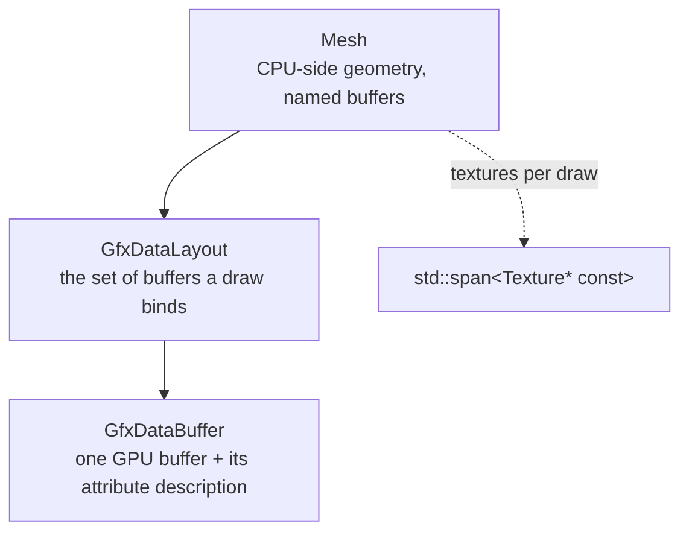

# Buffers, Layouts and Meshes

Geometry reaches the GPU through three layers, each with one job:



`Mesh` and the CPU-side buffers are shared by all three backends; `GfxDataLayout` and
`GfxDataBuffer` exist once per backend.

## `GfxDataBuffer` - one stream

A `GfxDataBuffer` is one vertex attribute stream or one index stream. It carries its GPU resource,
its element geometry (component type, component count, item size, item count), a dynamic flag, and
two tags: a `const char*` type name ("Vertex", "TexCoord", "Normal", ...) and an integer id for the
types that exist several times.

`Update(type, bufferTarget, index, data, dataSize, componentType, componentCount, forceUpdate)` is
the single entry point: it (re-)creates the GPU resource if needed and uploads.

The `index` parameter is the **attribute slot**, and that is where the shared registry comes in.

### The attribute slot registry

`include/shaderdatalayout.h` maps a `(type, id)` tag to a fixed, engine-wide slot:

| Slot | Attribute | | Slot | Attribute |
| --- | --- | --- | --- | --- |
| 0 | Vertex | | 7-10 | Offset/0-3 |
| 1-3 | TexCoord/0-2 | | 11-12 | Float/0-1 |
| 4 | Color | | 13-14 | Uint/0-1 |
| 5 | Normal | | | |
| 6 | Tangent | | | |

The slot means the same thing in each backend: a GLSL `layout(location = N)`, a Vulkan
`VkVertexInputAttributeDescription` location (HLSL `[[vk::location(N)]]`), and a DX12 input assembler
slot. The consequence is the decision: **shaders address buffers by slot, not by the order a mesh
created them in.** A mesh with only vertices and normals uses slots 0 and 5, and a shader that reads
those two works with it unchanged.

15 slots are used, and the table must stay below 16 - that is what OpenGL and Vulkan guarantee. An
unknown tag returns -1 and its buffer is skipped.

A second function, `GfxAttributeSemantic`, maps the same tag to an HLSL semantic name and index
(`POSITION`, `TEXCOORD`, `NORMAL`, `TANGENT`, `OFFSET`, `FLOAT`, `UINT`). DirectX matches attributes
by semantic rather than by slot, so both mappings have to exist and agree.

`ShaderDataLayout` / `ShaderDataAttributes` is the declaration side: a shader source states which
attributes it expects and in which format. The DirectX backend builds its
`D3D12_INPUT_ELEMENT_DESC` array from it; OpenGL ignores it.

### Integer attributes

An integer attribute must not be passed as a float. OpenGL needs `glVertexAttribIPointer` rather than
`glVertexAttribPointer` - with the wrong one a `uint` shader input reads a converted value or
garbage. `GfxDataBuffer::IsIntegerAttrib` decides, and that is why slots 13-14 ("Uint") are a separate
attribute type rather than floats that happen to hold integers.

### The backend implementations

**OpenGL** is the thin one: a buffer name, `glBindBuffer`, `glVertexAttribPointer`, an optional CPU
mirror. Handles are reference-counted through `SharedGfxHandle`, so a copied buffer shares the GPU
object rather than duplicating or leaking it.

**Vulkan and DirectX** have a problem OpenGL does not: a buffer written this frame may still be read
by a draw the GPU has not finished. Both solve it the same way, and it is the most intricate piece of
the buffer layer.

Each `GfxDataBuffer` owns `FRAME_COUNT` (2) buffer slots. A dynamic buffer writes the slot belonging
to the current frame index; a static buffer uses slot 0. But rotation alone is not sufficient, and the
reason is worth stating precisely:

> **A buffer is drawn from the slot its last `Update` wrote, in every frame until the next `Update` -
> not only in the frame it was written in.**

So a buffer that is updated rarely (a level mesh's index buffer, rewritten only when the batch layout
changes) is still being drawn from in the previous frame, out of the very slot this frame's index
picks next. The in-flight fence covers the frame with *this* index, never the one in between.

The bookkeeping that follows from it: each slot records the frame in which it stopped being the live
one (`m_slotRetiredFrame`), and a slot may be written in place only when it is **not** the live slot
**and** the frames in flight since it was retired have passed. Otherwise a fresh buffer is taken and
the old one's destruction is deferred by one frame slot through `GfxResourceHandler` (see
[04-command-lists.md](04-command-lists.md)). Two updates of the same buffer within one frame hit the
same rule.

Static buffers get no rotation to protect them, so *any* update of one that already holds data is
treated as the unsafe case.

Vulkan backs a data buffer with `GfxBuffer` (a `VkBuffer` plus a VMA allocation, persistently mapped
and host-visible), so there is no CPU mirror - writes go straight into mapped memory. The
`Bind` / `Release` / `EnableAttribs` / `Describe` methods are kept as no-ops so that the shared
`GfxDataLayout` code compiles unchanged; the actual `vkCmdBindVertexBuffers` is emitted by
`GfxDataLayout::Enable`.

## `GfxDataLayout` - the set a draw binds

A `GfxDataLayout` holds a list of data buffers plus one index buffer, the topology, an instance count,
and (in OpenGL) a vertex array object handle. It is what `Enable` / `Disable` bracket around a draw,
and `Render` is what issues it.

Three things about it are structural:

**It is stacked, not just current.** `Activate` pushes the previously active layout and makes this one
active; `Deactivate` pops and reactivates the previous one if it is still bound. So a draw nested
inside another draw's setup - which happens in the text and effect renderers - restores what it found.

**`Render` takes an index range.** `Render(textures, firstIndex, indexCount)` draws part of the index
buffer, with `indexCount == 0` meaning "to the end". Without it, a consumer that keeps several batches
in one mesh - a model whose faces are grouped by texture - would need a mesh per batch, which is a
state change and a set of buffers each. This is the mechanism that makes texture batching possible at
the level above.

**Buffer lookup is by tag.** `UpdateDataBuffer(type, id, buffer, componentType, forceUpdate)` finds
the buffer with that `(type, id)` tag or creates it, and resolves the attribute slot through the
registry. A caller never holds a buffer index.

`GfxStates::CountDraw` is called from `GfxDataLayout::Render`, so the draw counter counts exactly the
draws the library issues.

## Textures in a draw: spans

Every drawing entry point in the library takes its textures as `std::span<Texture* const>`:

```
GfxDataLayout::Render (std::span<Texture* const> textures, ...)
Mesh::Render          (std::span<Texture* const> textures, float alpha)
BaseRenderer::Render  (Shader*, std::span<Texture* const>, const RGBAColor&)
```

with two convenience overloads on top of each: one for a single `Texture*`, and one for a
`std::initializer_list<Texture*>` so a call site can write `mesh.Render({ diffuse, normal, gloss })`.

The reasons this is a span rather than an array or a container:

- **It binds nothing.** A caller can pass a `List`, an `AutoArray`, a C array, a single pointer or a
  braced list. The library has both `TextureList` (`List<Texture*>`) and `TextureArray`
  (`AutoArray<Texture*>`) in use, plus meshes that carry their own texture stack - all of them convert.
- **The position in the span *is* the slot.** `EnableTextures` walks the span and activates texture
  *i* on texture unit *i*. A null entry is skipped, which lets a caller leave a slot empty without
  building a different span.
- **No allocation and no ownership.** A draw does not own the textures it binds, and a span says
  exactly that.

The single-texture overload takes the address of its parameter and wraps it in a one-element span,
which is why it is written as a small inline rather than being folded into the span version.

On the backend side the span is where the abstraction diverges again: OpenGL's `Texture::Activate`
binds to a texture unit immediately, while Vulkan and DirectX write into the bind table described in
[04-command-lists.md](04-command-lists.md) and the descriptor set is materialized right before the
draw. The OpenGL backend keeps `ActivateTextures` / `DeactivateTextures` as aliases of
`EnableTextures` / `DisableTextures` purely so the three backends spell it the same way.

## `Mesh` - the CPU side

`Mesh` is shared code. It owns the CPU-side buffers, each in the type that suits it:

| Member | Type |
| --- | --- |
| vertices, normals, offsets | `VertexBuffer` |
| texture coordinates (3) | `TexCoordBuffer` |
| tangents | `TangentBuffer` |
| vertex colors | `ColorBuffer` |
| indices | `IndexBuffer` |
| float / uint streams | `FloatDataBuffer`, `UintDataBuffer` |

All of them derive from `VertexDataBuffer<APP_DATA_T, GFX_DATA_T>`, which keeps two representations:
a `SegmentedList` of the application's own type (`Vector3f`, `TexCoord`, `RGBAColor`) for building,
and a flat `AutoArray` of the GPU type for uploading. The split exists because building geometry wants
a growable container of meaningful elements while an upload wants one contiguous block of floats, and
a dirty flag says when the second has to be rebuilt from the first. `SegmentedList` grows without
moving what is already in it.

`Mesh::UpdateData` walks the buffers and pushes each one into the layout under its tag. The per-buffer
`UpdateXBuffer` methods are the individual half of the same.

### The buffer composition mask

`eMeshBufferBits` is a bit per potential mesh buffer, ordered as `UpdateData` processes them.
`m_meshBufferMask` records what a concrete mesh actually has.

It exists for `MeshHandler`, which pools meshes that are rebuilt every frame (text meshes above all).
`AllocMesh(mask)` hands out a *free mesh with exactly that buffer composition*, so a recycled mesh
never has a buffer the caller does not want or misses one it does.

The pool's lifetime rule is the same one that governs everything else in Vulkan and DirectX:
an allocated mesh is parked in the used list of the current frame slot; when that slot comes round
again `FRAME_COUNT` frames later, its GPU work has passed the fence and the parked meshes move back
to the free list. Reclaiming is lazy - the first allocation of a new frame does it - so no per-frame
hook is needed. The caller must not delete a pooled mesh.

`AbstractMesh` is the interface the mesh hierarchy is built on: `Create`, `Destroy`, `Update`,
`Render`. The concrete shapes (`Quad`, `Cube`, `IcoSphere`, `BaseQuadMesh`, `LineSegment`) derive
from `Mesh` and are covered in [09-components.md](09-components.md).

## Storage buffers: `GfxArray`

`GfxArray<DATA_T, STORAGE_T>` is the read-write buffer a compute shader or a fragment shader writes
into - the decal depth buffer is the canonical user. `STORAGE_T` is one of the `GfxTypes` tag structs,
`UavTexture` or `StructuredBuffer`, selecting which resource kind the backend creates.

The Vulkan implementation is a flat `R32_UINT` storage buffer with the 2D index folded into the
shader as `y * width + x`. The choice of a storage buffer over a storage image is documented in the
header and is a good example of the kind of decision the abstraction does not force: it avoids the
`GENERAL <-> TRANSFER_DST` layout transitions around every clear, lets the clear be a
`vkCmdFillBuffer` (much faster than `vkCmdClearColorImage`), and keeps atomics working the same way.

Uploads use per-frame-slot staging buffers for exactly the reason `GfxDataBuffer` rotates its slots:
a staging copy recorded into a command list runs at submit, so the next frame's memcpy must not
overwrite it.

`SSBO` (in each backend's `SSBO.cpp`) is the shader storage buffer for bulk read-only data; 20 slots
are reserved for them in the bind table.

## Divergences

- **`GfxArray` differs substantially in size and shape between the backends** (167 lines in OpenGL,
  512 in Vulkan, 655 in DirectX). The OpenGL version has the least to do - no staging, no layout, no
  descriptor - and the DirectX one the most.
- The Vulkan `GfxDataBuffer` keeps `char* m_data` "for source compatibility" although it is never
  used there.
- `GfxDataBuffer::Reset` (OpenGL) and `Clear` (Vulkan) are the same operation under two names.
- `Mesh::SetIndices` calls `IndexBuffer::SetGLData` - one of the remaining GL-flavoured names in the
  shared code.
- `USE_SHARED_HANDLES` is `#undef`'d and redefined to 1 at the top of the OpenGL `gfxdatabuffer.h` and
  `gfxdatalayout.h`, so the non-shared-handle branches in both files are unreachable.
