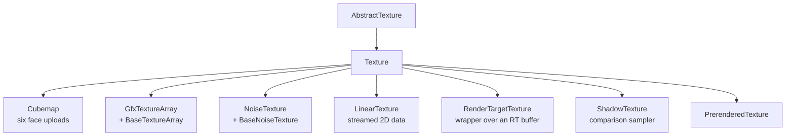

# Textures, Uploads and Samplers

Texturing is the largest surface the library exposes and the one where the three APIs differ most in
substance. The abstraction is shaped so that the *call site* is uniform and the *implementation* is
idiomatic in each backend, rather than forcing one API's model onto the others.

## The shapes

`AbstractTexture` is the interface: `Create`, `Destroy`, `IsAvailable`, `Bind`, `Release`,
`SetParams`, `Deploy`, `Load`. It is one of the few genuinely virtual interfaces in the library,
because textures *are* held through base pointers - a mesh's texture list, a draw's span, the handler's
lookup table.

Every derived shape follows the same rule: it adds **only** what is specific to it.
`Cubemap` adds six face uploads. `GfxTextureArray` adds the upload of the slots `BaseTextureArray`
staged. `ShadowTexture` adds a comparison sampler. Nothing else is duplicated.

`TextureBuffer` is the CPU side: the pixel data plus a `BufferInfo` describing width, height,
components, format and mip count. A `Texture` holds a list of them - a cube map has six, an ordinary
texture one - and `Deploy(bufferIndex)` sends one to the GPU.

## Create, load, deploy

The separation is deliberate and visible in every texture:

- **`Create`** makes the GPU object exist.
- **`Load`** reads files into `TextureBuffer`s. It takes a folder plus a list of file names, which is
  what makes a cube map a single `Load` call.
- **`Deploy`** uploads a buffer to the GPU.
- **`SetParams`** applies the sampling configuration.
- **`Bind` / `Release`** make it available to a draw.

`TextureCreationParams` carries the load-time options in one struct: premultiply, flip, mip maps,
color encoding (linear or sRGB), whether the texture is required, whether it is disposable, plus the
cartoonize parameters (blur, gradients, outline) and a key decoration for the lookup table.

Two file paths exist: SDL_image for PNG and the like, and `DDSLoader` for DDS - which is how
block-compressed data and pre-built mip chains get in. `TextureBuffer::BufferInfo` reflects that
split: the DDS path fills `m_gfxFormat` and `m_mipCount`, while the PNG path leaves the RGBA8 /
one-mip defaults. For block-compressed data the component count is 0 and the data size is the total
across all mip levels.

`glbloader` (glTF/GLB, via tiny_gltf) is the third input path and brings geometry as well as textures;
it belongs to [09-components.md](09-components.md).

## The texture handler

`TextureHandler` exists for one reason stated plainly in its header: to release every texture at
program termination in a defined order, without a dozen places in the game having to remember.
`Texture::textureLUT` is a static AVL tree keyed by name, and `Register` puts a texture into it.

Beyond teardown it offers `Redeploy`, which re-uploads everything - the path a display mode change
takes when the device is lost or recreated.

## Sampling

`TextureSampling` (see [02-api-abstraction.md](02-api-abstraction.md)) is the neutral description.
What happens to it is the deepest split in the library:

**Vulkan and DirectX** have sampler objects independent of the texture. `SamplerCache` maps a
`TextureSampling` value to a `VkSampler` / a D3D12 sampler descriptor through an AVL tree, created
lazily on first use and kept for the lifetime of the application. Two textures with the same sampling
share one sampler object. `Destroy` frees them all at shutdown, before the device goes.

**OpenGL** has no sampler objects in this library at all. Filtering and wrapping are state of the
texture object, set with `glTexParameteri` while the texture is bound. `Texture::SetParams` is
therefore split in two: `DefaultSampling` fills `m_sampling` with the policy (linear, mip mapped if
asked for, the recorded wrap modes) and `ApplySampling` writes `m_sampling` into the bound GL texture.
A derived texture with a filter policy of its own fills the record differently and applies it the same
way.

The consequence at the call site is the one to remember:

> In OpenGL the filter is a property of the texture and outlives the bind. In Vulkan and DirectX it is
> a property of the sampler, chosen per bind.

`RenderTarget::BindBuffer(bufferIndex, tmuIndex, filterMode)` is where this becomes visible: in
OpenGL the overload has to re-apply the filter with `glTexParameteri` on *every* bind, because the
previous binder may have left a different one on the same texture object.

### The wrap mode default

`Texture`'s constructor defaults to repeat, and the header records why: `SetParams` used to force
repeat on every texture regardless of the member, so repeat is what the default had been all along.
When `SetParams` started reading the member, the default had to be changed to say the same thing. The
two wrap axes are kept separately (`m_wrapMode`, `m_wrapModeV`) and differ only where asked for.

## Mip chains

Three paths, one result:

- **OpenGL 2D and 3D**: `glGenerateMipmap` - the driver builds the pyramid.
- **Vulkan and DirectX 3D**: `texture_mips.h` builds it on the CPU with a 2x2x2 box filter, and the
  upload feeds every level at create time. Neither API has `glGenerateMipmap`.
- **Texture arrays in VK/DX**: `BaseTextureArray::BuildMipChains` does the same per slot.

The split is stated explicitly in both headers because the *behaviour* has to be identical: every 3D
texture lands on the GPU with a full pyramid, addressable through `SampleLod`.

sRGB has its own path. `Downsample2D_SRGB8`, `GenerateSRGBMipChain` and `UploadSRGBMipChain` exist
because averaging sRGB-encoded texels as if they were linear is wrong - the mip chain has to be built
in linear space and re-encoded.

## Upload

Each backend has a `gfxupload.h` that forwards to its own: `oglupload`, `vkupload`, `dx12upload`.

**OpenGL** uploads with `glTexImage2D` / `glTexSubImage2D` / `glCompressedTexImage2D` and friends -
the data is copied by the driver and the call returns.

**Vulkan and DirectX** need a staging buffer in host-visible memory, a copy command recorded into a
command buffer, and an image layout / resource state transition around it. `vkupload` provides:

- `CreateStagingBuffer` (host write, `SEQUENTIAL_WRITE`) and `CreateReadbackBuffer` (host read,
  transfer destination) - two calls rather than one, because reading from a write-combined staging
  buffer is a mistake on some memory types;
- `BeginSingleTimeCommands` / `EndSingleTimeCommands`, a transient pool plus command buffer that is
  submitted and waited on - the simple, blocking path used where there is no frame yet;
- `UploadSubresource`, the low-level entry that records into an *already open* command buffer, for
  callers that have one.

`ImageLayoutTracker` (Vulkan) records the current layout of each image so the transitions can be
generated without the caller tracking state. DirectX tracks resource states in the equivalent place.

The staging buffer's lifetime is the caller's problem and the header says so: it must stay alive
until the command buffer has been submitted and waited on.

## Atlases and arrays

Both put many images behind one binding, which is what saves the batch. The library uses both and the
choice between them is documented in `base_texturearray.h` as a rule:

| | Texture array | Texture atlas |
| --- | --- | --- |
| layout | one slot per image, all the same size | images side by side in one image |
| borders | each slot has its own | cells sit flush against each other |
| mip maps | possible - a level never mixes slots | not possible - a level averages neighbours |
| filtering | possible | a bilinear tap at a cell edge reads the neighbour |
| use for | sprite sheets, anything filtered or minified | unfiltered, unminified cells |

Which is why every atlas in this library is created with nearest filtering and no mip maps, and why
sprite sheets are arrays.

`BaseTextureArray` owns the slot geometry and one flat CPU buffer - slot after slot, rows within a
slot - because that is exactly the layout every backend's 3D upload call wants, so the whole array
goes up in one call with no packing step. Every slot has the same size, and an undersized image is
scaled up into its slot with a bilinear resample (not a box filter: these are sprites being magnified,
and bilinear is what magnification wants). The scaling happens once, when the array is filled.

`BaseTextureAtlas` is the shared half of the atlases: a render target holding the image store, plus
the operations on it. `TextureAtlas` puts a fixed grid on top, `VariableTextureAtlas` a shelf packer
(`SkylinePacker`) for tiles of differing size. Neither knows about the other's layout.

An atlas normally owns its render target, but it may instead *be one array layer* of a target somebody
else owns - which is how many pages of the same atlas live in a single texture and a shader reaches a
page through a layer index rather than through a texture binding. The owner is then responsible for
the target's life.

## Render targets as textures

`RenderTargetTexture` is a `Texture` wrapping one color buffer of a `RenderTarget`, and `ShadowTexture`
is the depth equivalent with a comparison sampler for hardware PCF. They are thin by design, and the
one subtlety - one wrapper per color buffer rather than one per target - is described in
[05-render-targets-and-draw-buffers.md](05-render-targets-and-draw-buffers.md).

`LinearTexture` is the other direction: a texture written from the CPU every frame or so, which in
Vulkan means the image is replaced rather than overwritten, with the old one deferred through
`GfxResourceHandler`.

## Divergences

- The Vulkan `vkupload.h` header describes a "Phase B" submission model - a one-shot command buffer
  per upload, submitted and waited on - and names the `CommandList`-based path as future work,
  although `CommandList` exists. The low-level `UploadSubresource` entry is the one for callers with
  an open command buffer.
- `USE_SHARED_POINTERS` is `#undef`'d and defined to 0 in both `texture.h` and `texturebuffer.h`
  (OpenGL), while `USE_SHARED_HANDLES` is forced to 1 - so the shared-pointer branches are
  unreachable and the raw-handle branches are too.
- The OpenGL `Texture` stores its type and wrap mode as raw `GLenum` / `int` rather than as
  `TextureType` / `GfxWrapMode`, and converts at the boundary (`GLWrapMode`, `WrapModeFromGL`). The
  other two store the neutral enums.
- `texturehandler.cpp` exists once per backend although `texturehandler.h` is shared.
