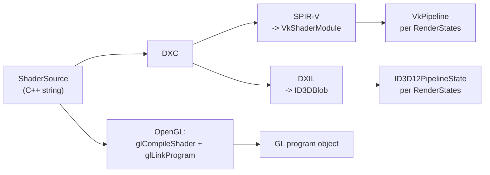

# Shaders

A shader crosses every boundary in the library: its source is text in a language the backend
dictates, its parameters are set through one API-neutral interface, and its compiled form is part of
a pipeline that only two of the three backends have. This document describes how those are separated.

## Shader sources live in C++

There are no `.glsl` or `.hlsl` files. A shader source is a `ShaderSource` object built from raw
string literals inside a `.cpp` file, registered under a name:

```
const ShaderSource& ToneMapShader() {
    static const ShaderSource toneMapShader("tonemap", Offset2DVS(), String(R"( ... )"), ...);
    return toneMapShader;
}
```

`ShaderSourceParams` names the stages - `vs`, `fs`, `gs`, `tcs`/`tes` (both or neither), or `cs` for a
compute shader - plus compiler macros, the expected vertex `dataLayout` and a minimum feature level.
Sharing a stage between shaders is then just calling the function that returns it, as the tone mapper
does with `Offset2DVS()`.

`BaseShaderCode` holds the registry: a dictionary from shader id to `ShaderSource`, built at startup
by `BaseShaderHandler::CreateShaders(shaderFolder)`. An application derives from both to add its own
shaders - `CreateShaderCode` is virtual for that, and `BaseShaderHandler` is a `PolymorphSingleton`
like the renderer.

### Two source sets, not three

| Backend | Source files | Language |
| --- | --- | --- |
| OpenGL | `opengl/src/*_shader.cpp`, `base_shader_funcs.cpp`, `base_texture_shaders.cpp` | GLSL |
| Vulkan | `src/common-hlsl/*.cpp` (10 files) | HLSL |
| DirectX | `src/common-hlsl/*.cpp` (the same 10 files) | HLSL |

Vulkan and DirectX share one set of HLSL sources, compiled to SPIR-V and DXIL respectively by the same
compiler (DXC). That is the reason the shared set exists: two backends, one source of truth, no
opportunity for them to drift apart in behaviour.

The file names are identical in both trees (`tonemap_shader.cpp` exists in `opengl/src` and in
`src/common-hlsl`), and each project file references only its own.

### The HLSL to GLSL bridge

For *snippets* shared with OpenGL there is a third arrangement: the snippet is written in HLSL as the
single source of truth, and the OpenGL backend prepends `hlslbridge.inl` to the final source so the
same body compiles as GLSL. The bridge is a block of `#define`s - `float2` to `vec2`, `lerp` to `mix`
and so on - emitted as a `String` for concatenation, together with the `#version` line from
`GLSLVersion()`.

The convention stated in the header is to include the whole bridge rather than individual defines:
unused defines cost nothing and one central mapping keeps the per-shader headers small.

HLSL backends never include the bridge - for them the syntax is native.

## Setting parameters

The public interface is the same in all three backends: `SetFloat`, `SetInt`, `SetVector2f`,
`SetMatrix4f`, `UpdateMatrices` and their relatives, all addressing a parameter **by name**. What
happens behind them is completely different.

**OpenGL**: a name is a uniform location, fetched with `glGetUniformLocation` and cached per shader.
`GetUniform` is the caching accessor - it looks the location up on first use and remembers it.

**Vulkan and DirectX**: there are no named uniforms. A parameter is a field at a byte offset inside a
constant buffer, and the offsets come from reflecting the compiled bytecode on link. `SetB1Field(name,
data, size)` looks up the offset in a per-shader cache and writes into a CPU-side staging buffer; a
miss scans the reflected per-stage field tables once and caches the result.

### The four base matrices

Model-view, projection, viewport and light transform are addressed by **enum** rather than by name:

```
enum eBaseMatrices { bmModelView, bmProjection, bmViewport, bmLightTransform, bmCount };
Shader::SetMatrix4f (eBaseMatrices, const float*, bool transpose);
```

They are the base inventory every shader has, and giving them a fixed identity removes them from the
name lookup entirely. In Vulkan and DirectX they live in `FrameConstants`, the 256-byte `b0` constant
buffer, and `TrySetB0Field` maps the enum to its slot with a `switch`. In OpenGL they get their own
location cache, `m_baseLocations[bmCount]`, with a sentinel for "not looked up yet".

This is the one place where a call site must use the enum: in Vulkan and DirectX the string form goes
only to `SetB1Field`, so setting one of the four by name silently fails with "unknown uniform" and the
matrix is never set. The compiler cannot catch it.

### The Vulkan descriptor set layout

Fixed, one layout for every graphics shader, which is what lets the bind table
([04-command-lists.md](04-command-lists.md)) stage bindings without knowing the shader:

| Binding | Type | Stage | Register |
| --- | --- | --- | --- |
| 0 | uniform buffer, dynamic | all graphics | b0 - FrameConstants |
| 1-3 | uniform buffer, dynamic | VS / PS / GS | b1 per stage |
| 4-19 | sampled image | fragment | t0-t15 |
| 20-35 | sampler | fragment | s0-s15, paired 1:1 with the t-slots |
| 36-39 | storage buffer | all graphics | u0-u3 |
| 40-41 | uniform buffer, dynamic | tessellation control / evaluation | b1 per stage |
| 42-58 | storage buffer (read-only) | all graphics | t0-t16, space1 |

The `b1` buffers being *dynamic* uniform buffers is what makes per-draw constants cheap: the
descriptor set stays the same and only an offset changes.

### Constant buffer allocation

`CbvLinearAllocator` is the per-frame linear allocator behind that. Each frame slot owns one
persistent-mapped host-visible uniform buffer; `Allocate(size)` returns a `{cpu pointer, dynamic
offset, buffer}` triple, the caller memcpy's its constants in, and the offset goes into
`vkCmdBindDescriptorSets`. `Reset(frameIndex)` rewinds the cursor at frame start.

A frame that exceeds its slot's buffer chains further buffers on the spot rather than failing, and if
the previous frame overshot, the slot's own buffer is reallocated up to a ceiling. So an allocation
fails only when the device is out of memory - which is what lets a caller treat it as infallible.

## Binding a shader for a draw

`BaseShaderHandler::SetupRenderShader(shaderId, depthShaderId)` selects and activates a shader, with
the handler tracking which one is active (`m_activeShader`, `m_activeShaderId`) so a repeated setup
does not re-activate.

`InvalidateActiveShader` exists because that tracking is a lie after a frame boundary in DirectX: a
new command list clears all pipeline state, so the tracking has to be reset or the next setup skips an
activation that is genuinely needed.

`Shader::UpdateVariables` runs right before each draw and is where the staged state becomes real: in
Vulkan it allocates a descriptor set, writes the bind table into it and binds it with the dynamic
offsets; in DirectX it writes the descriptor heap entries and sets the root arguments; in OpenGL there
is nothing to do because the uniforms were set when they were set.

## From source to pipeline



`ShaderCompiler` wraps DXC (`IDxcCompiler3` / `IDxcUtils`) behind plain C++ calls, with `-spirv` for
Vulkan. `dxcompiler.dll` is delay-loaded. The optimization level follows the build: `-Od` in debug,
`-O3` otherwise. Register-class shifts (`-fvk-b-shift` and friends) are passed by the caller, because
they have to agree with the descriptor set layout above.

In OpenGL a program object *is* the compiled shader and there is nothing more to build. In Vulkan and
DirectX the compiled bytecode is only one half of a pipeline; the other half is the `RenderStates`
block, and the pipeline is created per combination - which is the mechanism described in
[02-api-abstraction.md](02-api-abstraction.md).

## The caches

Three separate caches, at three levels:

- **`ShaderCache`** (shared, `include/shadercache.h`) is a small on-disk blob store: an FNV-1a hash of
  whatever identifies a compilation, a header with a magic number, tag, key and size, and the bytes.
  It is what keeps DXC from recompiling unchanged HLSL on every start.
- **The pipeline / PSO cache** keys a pipeline on `{shader, RenderStates}` and lives in memory:
  `PipelineCache` in Vulkan, `PSO::GetPSO` in DirectX.
- **The on-disk pipeline store**: `VkPipelineCache` in Vulkan, `ID3D12PipelineLibrary` in DirectX,
  loaded by `BaseRenderer::LoadPipelineCache` and written by `SavePipelineCache`.

`PrecreatePipelines` closes the loop: DirectX additionally records the `{shader name, RenderStates}`
pairs it needed, so a later run can build those pipelines up front instead of during play. Lazy
pipeline creation in the middle of a frame is a visible stutter, and this is the answer to it.

## Compute shaders

`ComputeShader` is a separate class in each backend. A compute `ShaderSource` carries `cs` instead of
the graphics stages plus an explicit `computeBindings` array of `ComputeBindingDesc` entries (binding
index, kind, count) - because a compute pipeline's descriptor layout is not the fixed graphics one
above and has to be described. The target profile is `cs_6_0`.

`BaseShaderHandler::SetupComputeShader(shaderId)` is the entry point.

## Ready-made shaders in the library

The library brings its own shader inventory, which is why `BaseShaderHandler` has loader methods
rather than only a registry: `LoadLineShader`, `LoadRingShader`, the plain texture shaders, the blur
and outline shaders, tone mapping, the skybox and black hole shaders, lightning. Their sources are the
`*_shader.cpp` files, and the components that use them are described in
[09-components.md](09-components.md).

`GaussBlurParams` and the precomputed Gauss kernels (`ComputeGaussKernels`, `GetKernel(radius)`) sit
on the handler for the same reason: every blur in either application wants the same kernels, and
computing them once at startup is cheaper than per use.

## Divergences

- `vulkan/include/shader_compiler.h` still describes the descriptor layout work as "Phase B step 7c"
  future work, although the layout exists and is documented in `shader.h`.
- The Vulkan `Shader` keeps the HLSL source strings and the SPIR-V blobs alive after module creation
  "for reload / debug", which is not required for the module's lifetime.
- The OpenGL tree and the shared HLSL tree hold ten files of identical names
  (`base_shader_funcs.cpp`, `base_texture_shaders.cpp`, `blackhole_shader.cpp`, `blur_shader.cpp`,
  `lightning_shader.cpp`, `line_shader.cpp`, `outline_shader.cpp`, `primitive_shaders.cpp`,
  `skybox_shader.cpp`, `tonemap_shader.cpp`). Nothing enforces that the GLSL and the HLSL version of
  a shader behave the same; the pair has to be kept in step by hand.
- `BaseShaderHandler`'s constructor has a disabled (`#if 0`) load of a gray noise texture whose member
  `m_grayNoise` is still declared.
